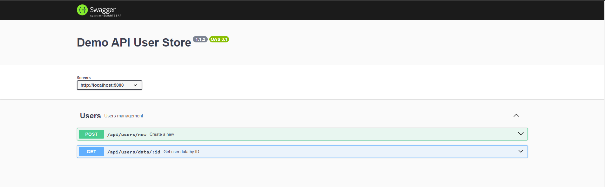

# Project Name

This project is an example of generating Swagger documentation using Swagger JSDoc.

## Prerequisites

- Node.js (version X.X.X or higher)
- npm (version X.X.X or higher)

## Installation

1. Clone the repository:

2. Change Directory  & Install the dependancies 

```shell
npm install
```

3. Start the project.

```shell
node start
```

## Endpoints
This project exposes the following endpoints:

*BASE URL : 'http://localhost:5000'*


**POST /api/users/new**
This endpoint allows you to create a new user by sending a POST request to /new. The request body should include the name and age of the user. Upon successful creation, the server will generate a new ID for the user and add the user to the cache. The response will include the newly generated ID.

**GET /api/users/data/:id**
This endpoint allows you to retrieve user data by ID. Send a GET request to /data/:id, where :id is the ID of the user you want to retrieve. If the user with the specified ID exists in the cache, the server will respond with the user's data, including their name and age. If the user does not exist, a 404 error will be returned.


Thank you happy coding !